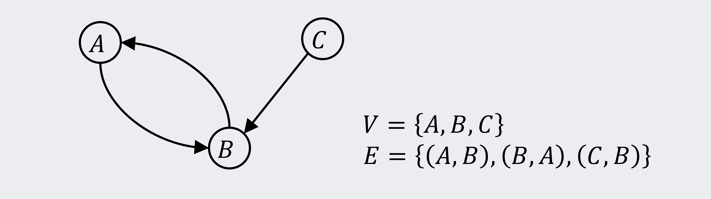
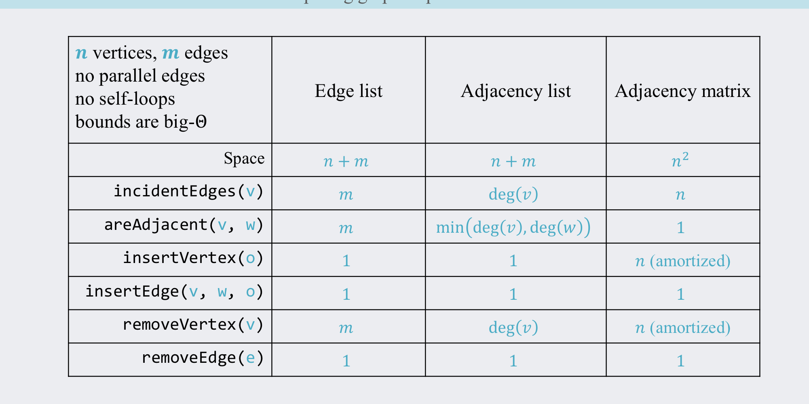

# Graph Notes for 221

## What is a Graph?
Collection of vertices (nodes) connected via edges.   
**G = (V, E)**   
**V** is a set of vertices; {v_1, v_2, v_3, ..., v_n}   
**E** is a set of edges; {e_1, e_2, e_3, ..., e_m} where each e_i is a pair of vertices: e_i = (V x V)   
If each edge is an ordered pair, eg (A,B) != (B,A) then the graph is **directed** (The edges have a direction, they act like a one way street) otherwise the graph is **undirected**.    

## Graph Terminology:
- **Vertices Adjacent to *V*:** *N(v)* Neighbouring vertices to a vertex. Represented as a set of vertices   
- **Edges Incident to *V*:** *I(v)* Set of edges attached to a particular vertex   
- **Degree of *V*:** *|I(v)|* The number of edges connected to a vertex (Integer)  
- **Path:** Sequence of vertices connected by edges   
- **Simple Path:** A path with no repeated vertices. No Dupes   
- **Cycle:** A path with the same start and end vertex   
- **Simple Graph:** No self-loops or multi edges. **Self-loops** are when a vertex has an edge that points to itself. **Multi-Edges** are when two vertices have multiple edges between each other.   
- **Subgraph of *G = (V, E)*:** Small part of the graph *G*. All the vertices in the subgraph G' are also in *V*. All edges in G' are in *E*. If (u, v) is in E', then u and v are in V'.   
- **Complete Graph:** A graph where every vertex is connected to every other vertex   
- **Connected Graph:** A graph where there exists a path between every pair of vertices   
- **Connected Component:** A connected subgraph   
- **Acyclic Graph:** A graph with no cycles   
- **Spanning Tree of *G = (V, E)*:** Acyclic, connected graph with vertex set *V*. It contains all the vertices of the original graph and its connected. It "spans" the entire graph. Spanning trees have *n - 1* edges, *n* being the number of vertices. There can be many different possible spanning trees for a graph.  
- **Spanning Forest:** Collection of spanning trees, one for each connected component   

## Weighted Graphs
In a *weighted graph*, each edge is assigned a weight (Some value, normally a number).  
The weight represents the cost to travel along the edge. (They can possibly be negative)  
- Dijkstras algorithm uses weighted graphs to find the shortest path between two vertices. But it can't handle negative weights, gotta use the Bellford-Whatever-the-fuck algo.   

## Connectivity
- Undirected graphs are **connected** if there is a path between any two vertices   
- Directed graphs are **Strongly connected** if there is a directed path from any vertex to another. You can get to any vertex from any starting vertex within a directed graph.   
- Digraphs are **weakly connected** if there is a path between any two vertices, ignoring direction. Still a directed graph, but not strongly connected

## Isomorphism and Subgraphs
- **Isomorphic Graphs:** Graphs with identical structure (Ignoring the names of the vertices). Isomorphic graphs have the name number of vertices, edges, and each pair of vertices are conencted in the same way. If One of these are violated, the graph is not isomorphic.   
- **Subgraph:** Graph that is isomorphic to a *part* of another graph   

## Degree
- **Degree of a vertex** represesnts the number of edges incident to a vertex   
- **Handshaking theorem:** If *G = (V, E)* is an undirected graph, then the number of vertices. ∑deg(v) = 2|E|.  Each pair of vertices only has one edge between the two. If you had two vertices connected to each other, there is only one edge, not two. The handshaking formula may make more sense when rearranged to be 1/2∑deg(v) = |E|.   

## Degree for directed graphs
- **In-Degree:** The number of edges entering *v*. Denoted as deg^- (v)   
- **Out-Degree:** The number of edges leaving *v*. Denoted as deg^+(v)   
- deg(v) = deg^-(v) + deg^+(v)   

## Graph Density
- **Sparse Graph:** has O(|V|) edges. Each vertex has at most O(1) neighbors. Remeber O(x) is an upperbound   
- **Dense Graph:** has Θ(|V^2|) edges. Eg if every vertex has O(|V|) neigbours. Eg a complete graph.   
- Anything inbetween is either on the spare side or on the dense side, depending critically on the context.   

## How many edges?
**At least:**
- Connected: *n - 1* edges. Eg a spanning tree  
- Not connected: 0 edges. A bunch of vertices with zero edges.   
**At most:**
- Simple: *n(n-1)/2* edges. Every vertex conenects to every other vertice.  
- Not simple: *Unbounded*. Imagine two vertices, with an infinite number of edges that connect the two.   

## Adjacency Matrix
- Vertices are stored in a matrix, with the indexes of the arrays representing each vertice. The intersecting cell signifies to us if there is an edge between the two vertice. You can use anything like a boolean for this.   
- Vertices can be stored in a hashmap so you can map vertice names to an integer value. Because an adjacency matrix is just two arrays, and arrays use integer indexes Kasper.   
- Edges can also be stored in a hashmap so you can map vertice names + edges to an integer value   
- **insertVertex(vertex v)** O(n) amortized. Like when you're inserting into an array. You might have to shift elements, and you also have to add edges.   
- **removeVertex(vertex v)** O(n) amortized. Like when you're removing from an array, you mught have to shift elements and also remove any corresponding edges.   
- **areAdjacent(vertex v, vertex u)** O(1). Arrays have O(1) lookup on its indexes which makes checking if two vertices are connected quick.   
- **incidentEdges(vertex v)** O(n). Check every value in a vertex's row (or column) and find which other vertices are connected to a vertex.   
- **Space usage:** O(n) + O(m) + O(n^2) = O(n^2).
- *m* is the edges. *n* is the vertices.   
- *Unweighted*: The matrix can contain booleans  
- *Weighted*: The matrix contains the edge weights. Use a value like infinity for edges that DNE.   

## Adjacency List
- Vertices are stored in a hashmap (or even an array if the index corresponds to a vertex). The key (or index) is the vertex, and the value stores a linked list of all adjacent vertices. Use a doubly-linked list for O(1) removals. O(n) space used  
- Edges are also stored in a hashmap (or array) where the key (or index) represents the edge name, and it stores a pair of vertices, which are the two vertices the edge connects. O(m) space used.   
- **insertVertex(vertex v)** O(1)   
- **removeVertex(vertex v)** deg(v). You need to remove its connection to every other vertex v is connected to.   
- **areAdjacent(vertex v, vertex u)** worst case: max(deg(v), deg(u)). Since you need to go through every incident edge.
if the list tracks its length: min(deg(v), deg(u))   
- **incidentEdges(vertex v)** deg(v)   
- **Space usage:** O(n + m)   

## Edge List
- Edges are stored in a hashmap or array   
- Uses less space but poor perofrmance for most operations   

## Time Complexities of Graph Implementations

## Time Complexities